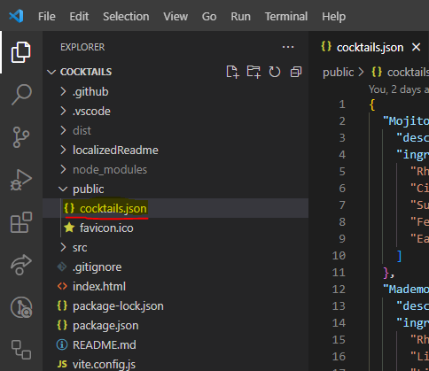
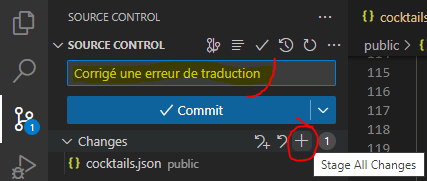
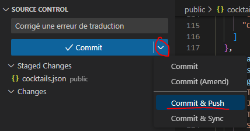
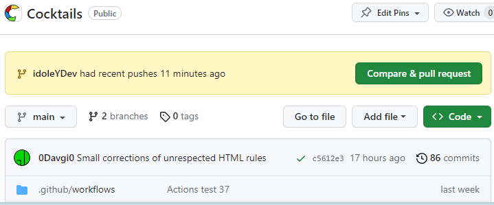
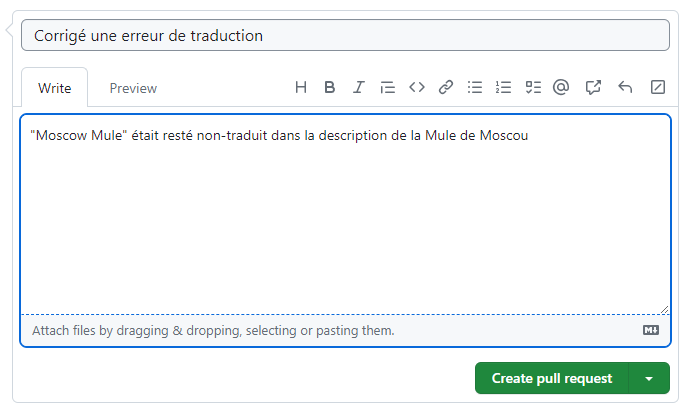

## Mise en place initiale

Alors, pour commencer tu auras besoin de VSCode (logique)  
  
Il va aussi te falloir installer [git](https://git-scm.com/download/win) puis *npm*, qui fait partie de [NodeJS](https://nodejs.org/dist/v18.18.2/node-v18.18.2-x64.msi).  

Ensuite, tu vas créer un dossier nommé `repos` dans *Mes Documents*. Une fois dans le dossier il te faudra y ouvrir un terminal (dans la barre d'adresse, tape `cmd`) et y taper ceci :

```bash
git clone https://github.com/cogilabs/Cocktails.git
```
  
Une fois ceci fait, un dossier `Cocktails` devrait avoir apparu dans `repos`.

Vas dans ce dossier, fais-y un clic droit puis "Ouvrir dans VSCode" (si tu es sur Win11, tu auras peut être besoin de faire "Afficher d'autres options").

À partir de là, tu as ouvert le repo dans VSCode et a accès au code.

Ensuite, tu va faire `Ctrl`+`%` pour ouvrir le terminal intégré, puis y taper

```bash
npm install
```

À ce moment là, tu as une copie fonctionnelle de l'appli sur ton PC, tu peux la lancer avec

```bash
npm run dev
```

## Modifier le code

Premièrement, il serait intéressant de te créer une branche de travail, ce que j'ai pris le soin de faire.

Une branche est une sorte de copie du code principal, où tu peux travailler sans risque de modifier ce dernier, quand te modifications sont bonnes, tu fais ce qu'on appelle une *Pull-Request* pour intégrer et déployer tes modifications.  

Ta première étape est de passer sur ta branche :


À partir de là, tu peux déjà modifier des trucs, comme `cocktails.json` par exemple, qui se trouve dans `/public`



## Envoyer tes modifications

Après avoir fait ta modification, il va falloir la commiter. Pour se faire, après avoir enregistré le fichier, il faut *stage* tes changements en appuyant sur le `+`.

**Attention :** Il ne faut pas oublier de mettre un message de commit, qui résume rapidement ce que tu as fait.



Une fois ceci fait, tu vas donc pouvoir `commit` et `push` ton travail dans ta branche



## Appliquer tes modifications

La suite va se passer directement en ligne, sur [GitHub](https://github.com/cogilabs/Cocktails).

Sur [le repo](https://github.com/cogilabs/Cocktails), tu devrait avoir une alerte concernant ta branche :



Tu vas donc cliquer sur `Compare & pull request`.  
Ici tu vas pouvoir donner un peu plus de détails sur ce que tu as fait, puis faire la Pull-Request en cliquant sur `Create pull request` :



## Fin

Et voilà ! Plus qu'à attendre que je valide la Pull-Request et que je déploie le code !