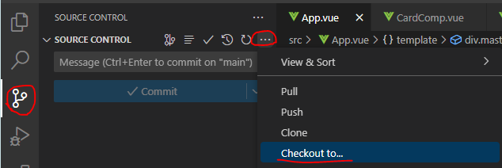
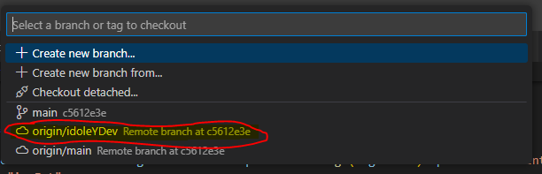

## Mise en place initiale

Alors, pour commencer tu auras besoin de VSCode (logique)  
  
Ensuite, il va te falloir installer [git](https://git-scm.com/download/win) puis npm, qui fait partie de [NodeJS](https://nodejs.org/dist/v18.18.2/node-v18.18.2-x64.msi).  

Ensuite, tu vas créer un dossier nommé `repos` dans *Mes Documents*. Une fois dans le dossier il te faudra y ouvrir un terminal (dans la barre d'adresse, tape `cmd`) et y taper ceci :

```bash
git clone https://github.com/cogilabs/Cocktails.git
```
  
Une fois ceci fait, un dossier `Cocktails` devrait avoir apparu dans `repos`.

Vas dans ce dossier, fais-y un clic droit puis "Ouvrir dans VSCode" (si tu es sur Win11, tu auras peut être besoin de faire "Afficher d'autres options").

À partir de là, tu as ouvert le repo dans VSCode et a accès au code.

Ensuite, tu va faire `Ctrl`+`%` pour ouvrir le terminal intégré, puis y taper

```bash
npm install
```

À ce moment là, tu as une copie fonctionnelle de l'appli sur ton PC, tu peux la lancer avec

```bash
npm run dev
```

## Modifier, et envoyer tes modifications

Premièrement, il serait intéressant de te créer une branche de travail, ce que j'ai pris le soin de faire.

Une branche est une sorte de copie du code principal, où tu peux travailler sans risque de modifier sur le code principal, quand te modifications sont bonnes, tu fais ce qu'on appelle une *Pull-Request* pour intégrer et déployer tes modifications.  

Ta première étape est de passer sur ta branche :



