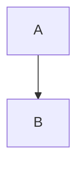
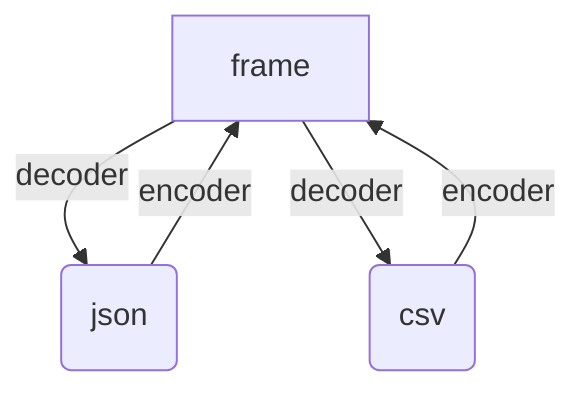
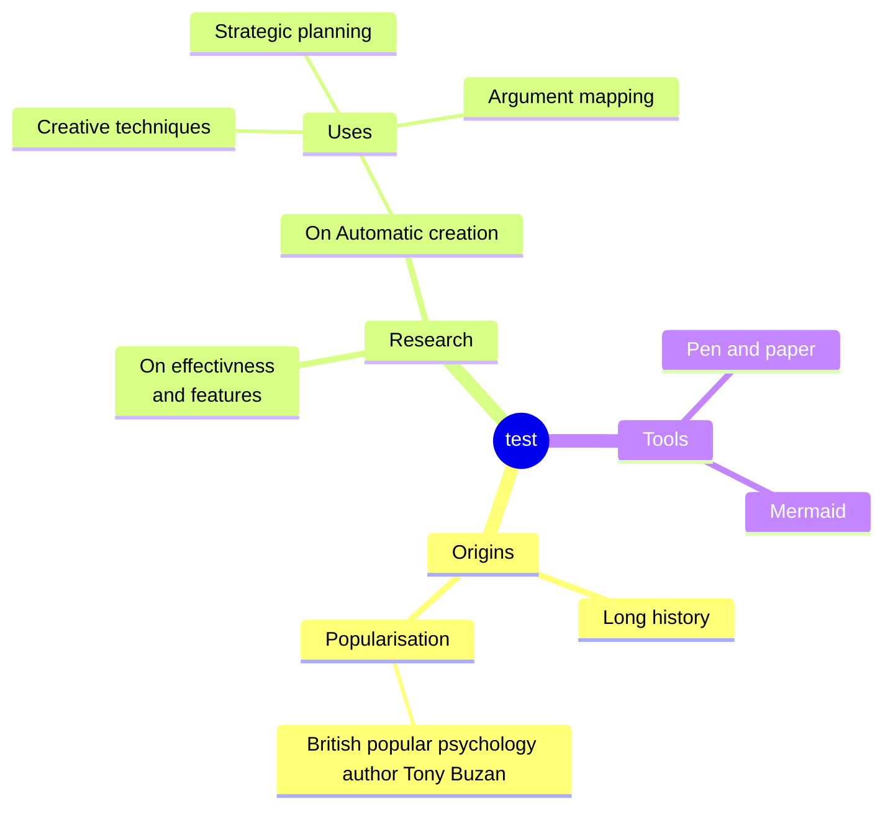
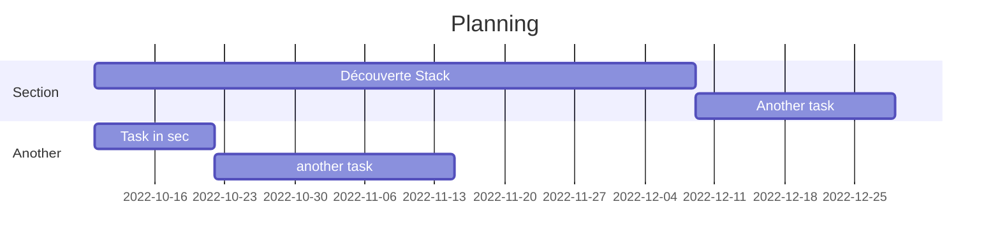

# Private-Notes

```mermaid
graph
A-->B
```

```mermaid
graph TD;
    A[frame]-->|decoder| B(json);
    A-->|decoder| C(csv);
    B-->|encoder| A;
    C-->|encoder| A;
```

```mermaid
mindmap
  root((test))
    Origins
      Long history
      Popularisation
        British popular psychology author Tony Buzan
    Research
      On effectivness<br/>and features
      On Automatic creation
        Uses
            Creative techniques
            Strategic planning
            Argument mapping
    Tools
      Pen and paper
      Mermaid
```

```mermaid
gantt
    title Planning
    dateFormat  DD/MM/YYYY
    section Section
    Découverte Stack :a1, 10/10/2022, 60d
    Another task     :after a1  , 20d
    section Another
    Task in sec      :10/10/2022  , 12d
    another task      : 24d
```
